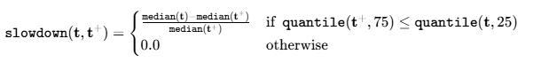
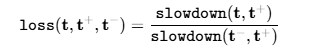

# LAAB-Python:  Linear Algebra Awareness Benchmarks for Python

Machine learning frameworks such as PyTorch, TensorFlow, and JAX are designed to scale numerical computations and data processing from single to multi-GPU and distributed computing environments, while abstracting much of the underlying complexity of parallelisation. Amid the growing use of machine learning in traditional high-performance computing application areas-for example, protein modeling and bioinformatics—researchers and practitioners increasingly employ these frameworks to integrate ML algorithms into their scientific computing applications, such as those involving solution of partial differential equations, eigenvalue problems, etc.

Linear algebra operations, which are the building blocks of countless computational problems, often constitute major performance bottlenecks. The HPC community invests significant effort in developing architecture-specific optimised kernels, such as those provided by the BLAS and LAPACK libraries, to accelerate these operations. Thanks to high-level frameworks, users no longer need to engage in the error-prone and time-consuming process of directly invoking such kernels; instead, they can express computations using a high-level, mathematics-like syntax that closely mirrors textbook notation, without having to manage the low-level implementation details themselves. However, it is not guaranteed that these frameworks will automatically exploit knowledge of linear algebra to accelerate computations in the way expert-tuned implementations would.

## The benchmark suite

This benchmark consists of five tests that evaluate the linear algebra awareness of high-level Python interfaces in a given installation of PyTorch, TensorFlow, and JAX.

**Test 1: Matrix multiplications.** Matrix-matrix multiplications are one of the most expensive operations. The execution times of matrix multiplications invoked through the high-level APIs of the frameworks are compared against those of an optimised reference implementation. For general dense matrices, execution time is compared with the BLAS kernel `gemm`. For triangular matrices and symmetric rank-k updates, which require only about half the floating-point operations of `gemm`, the execution speed is compared against the specialised BLAS kernels `trmm` and `syrk` respectively. For multiplication with a tri-diagnoal matrix (where only a  fraction of the matrix elements are non-zero), the execution can be orders of magnitude faster than the multiplication that assumes regular matrices. Here, the execution times are compared against those of a reference that uses compressed row formats. 


**Test 2: Common sub-expression elimination.** In general, sub-expressions within an expression that evaluate to the same value can be computed once and reused via a temporary reference in subsequent instances. For example, in the expression $A^TB +A^TB$, the matrix multiplication $A^TB$ aprrears twice and can be computed only once. Such common sub-expression eliminations can improve performance in some cases, while in others it may not; for example, in the expression $A^TBA^TBy$, where $y$ is a vector, the fastest evaluation strategy might be to avoid the matrix product $A^TB$ altogether. Instead, one can evaluate the expression right-to-left, using only matrix–vector products, thereby sidestepping the expensive matrix–matrix multiplication. This test evaluates the application of common sub-expression elimination on several input expressions.

**Test 3: Matrix chains.** Given $m$ matrices of suitable sizes, the product $M = A_1A_2...A_n$ is known as a matrix chain. Because of associativity of matrix product, matrix chain can be computed in many different ways, each identified by a specific paranthesisation. The different parenthesisations may vary in the number of FLOP counts and performance. This test evaluates the performance of a set of input matrix chain expressions against reference implementations that use the optimal parenthesisation.

**Test 4: Expression rewrites.** Algebraic properties can be used to rewrite an expression in several alternative ways that can result in accelerated evaluations. For example, the expression $AB +AB$ can be rewritten as $A(B+C)$, reducing the number of matrix–matrix multiplications from two to one. This test evaluates rewrites based on the distributive law and blocked matrix multiplications.

**Test 5: Code motion.** Some operations, when moved around, can result in improved performance. This test evaluates if the frameworks can identify loop-invariant code and partial operand accesses to improve performance.


## The evaluation procedure

Each test consists of one or more input expressions in a high level syntax. The execution times of each input expression (measured 10 times) are compared against those of an optimised reference implementation and the fraction by which the input expression is slower than the reference implmentation is computed as follows,

<!-- <p align="center">
  
</p> -->


<!-- $$
\texttt{slowdown}(\mathbf{t}, \mathbf{t}^{+}) =
    \begin{cases}
        \frac{\texttt{median}(\mathbf{t}) - \texttt{median}(\mathbf{t}^{+})}{\texttt{median}(\mathbf{t}^+)} & \text{if } \ \texttt{quantile}(\mathbf{t}^{+}, 75) \le \texttt{quantile}(\mathbf{t}, 25)  \\
        0.0 & \text{otherwise} 
    \end{cases} 
$$ -->
Here, $\mathbf{t}$ and $\mathbf{t}^{+}$ are the list of execution time measurements of the input expression and the reference implementation respectively, and $\texttt{quantile}(\mathbf{t}, x)$ denote the $x^{th}$ quantile value of $\mathbf{t}$. Note that the execution times can vary due to system effects, and therefore, the slowdown is greater than 0 only when the execution speed of the input expression is significantly slower than the reference. We consider this difference to be significant if and only if the 75th quantile value of the execution time of the reference is less than or equal to the 25th quantile value of the input. A slowdown value of 0.0 indicates that the input expression is not significantly slower than the reference. A slowdown value of $0.5$ indicates that the input expression is slower than the reference by a fraction $0.5$; in other words, the input requires $50$ percent more time than the reference.

While the slowdown metric is useful for comparing one or more input expressions against a reference within the same test, it does not provide a direct basis for comparing losses across different tests. For instance, a slowdown value of 0.5 may indicate a substantial loss for test A, yet represent only a minor loss for test B.
Therefore, for each input expression, we also consider a negative reference, which is a sub-optimal implmentation, and measure the execution times $\mathbf{t}^{-}$. Then, for a given input expression, the loss is defined as the ratio of the slowdown of $\mathbf{t}$ to the slowdown of $\mathbf{t}^-$ with respect to the optimised reference $\mathbf{t}^+$. That is,



<!-- $$
\texttt{loss}(\mathbf{t}, \mathbf{t}^+, \mathbf{t}^-) = \frac{\texttt{slowdown}(\mathbf{t}, \mathbf{t}^+)}{\texttt{slowdown}(\mathbf{t}^-, \mathbf{t}^+)}
$$ -->
For each test, the $\texttt{slowdown}$ and $\texttt{loss}$ scores are reported. A test is considered pass if $\texttt{loss} \le 0.05$. For a given framework installation, the overall benchmark result include the mean $\texttt{loss}$ and the number of tests passed.


<!-- If you are using this benchmark, please also cite the software, -->

## The usage and example

If you want to run the benchmark, refer [here](examples/README.md). 

If you just want to access the results, the evaluation reports from previously run benchmarks are available in the [`reports/`](reports/) directory. 

An example evaluation report for the installation of PyTorch/2.1.2-foss-2023a on the HPC system Kebnekaise, hosted at Umea University in Sweden is available [here](examples/PyTorch/2.1.2-foss-2023a/HPC2N_x86_64/1xCore/amd_zen3/README.md).


## Cite

More details about this benchmark can be found in the following publications,

```
@inproceedings{sankaran2022benchmarking,
  title={Benchmarking the Linear Algebra Awareness of TensorFlow and PyTorch},
  author={Sankaran, Aravind and Alam, Shourov and Karlsson, Lars and Bientinesi, Paolo},
  booktitle={Proceedings of the 2022 IEEE International Parallel and Distributed Processing Symposium Workshops (IPDPSW)},
  pages={924--933},
  year={2022},
  address={Lyon, France},
  publisher={IEEE},
  doi={10.1109/IPDPSW55747.2022.00150}
}
```